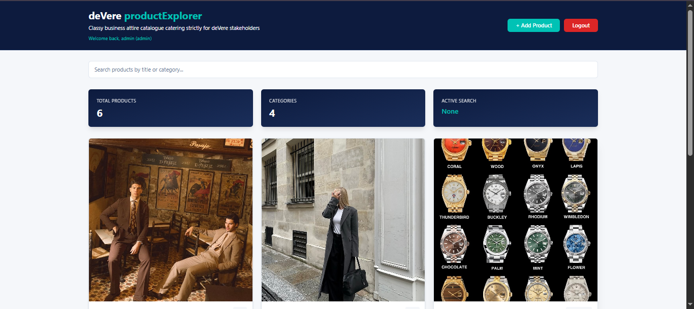

# 👔 deVere Product Explorer

Welcome to the **deVere Product Explorer** — a curated catalogue of classy business attire for deVere stakeholders. Browse available items, search for specific products, add new items, and view detailed information about each product. The app includes secure login so different users can track who added what.

<p align="center">
  
</p>

---

## 🔗 Links

- **GitHub Repository:** [github.com/MawandeM-98/product-explorer-signalstore](https://github.com/MawandeM-98/product-explorer-signalstore)
- **AI Usage, Tradeoffs & Assumptions:** See the [Wiki page](https://github.com/MawandeM-98/product-explorer-signalstore/wiki) on the repository

> ⚠️ **Note for testers:** Use the **`develop` branch** — it works best for testing. Changes are merged into `main` only when the code is production ready.

---

## ✨ Features

- **Secure login** — role-based access for Admin and User accounts
- **Browse catalogue** — view all available business attire in a clean grid
- **Search** — filter products by name or category
- **Add products** — contribute new items via an in-app form
- **View details** — click any product to see full information
- **Role-based visibility** — Admins see everything; Users see their own items plus shared ones
- **Fake database** — powered by JSON Server for instant updates during testing
- **Angular 19** — built with the latest Angular, standalone components, and modern tooling

---

## 🚀 How to Run This Project

### What You'll Need

- **Node.js** installed (version 18, 20, or 22 works fine)
- A terminal (Command Prompt, PowerShell, or the one inside VS Code)

### Step-by-Step Instructions

**1. Clone the repository**

```bash
git clone https://github.com/MawandeM-98/product-explorer-signalstore.git
```

**2. Go into the project folder**

```bash
cd product-explorer-signalstore
```

**3. Switch to the `develop` branch**

```bash
git checkout develop
```

**4. Install dependencies**

```bash
npm install
```

**5. Start the fake database (JSON Server)**

Open a terminal and run:

```bash
npx json-server --watch db.json --port 3000
```

You should see:

```
JSON Server started on PORT :3000
```

It will give the two following endpoints:

```
http://localhost:3000/products
http://localhost:3000/users
```

**6. Start the Angular 19.2.0 app**

Open a **second terminal** and run:

```bash
ng serve
```

You should see:

```
http://localhost:4200
```

**7. Open your browser**

Go to **[http://localhost:4200](http://localhost:4200)**

You'll be redirected to the login page.

---

## 🔐 Demo Login Credentials

| Username | Password | Role |
|---|---|---|
| `admin` | `admin` | Admin |
| `user` | `user` | User |

> **⚠️ Password and Username are case-sensitive** — they must be entered in **lowercase**.

### What Each Role Sees

| Role | Visibility |
|---|---|
| **Admin** | All products (hardcoded + admin added + user added) |
| **User** | Hardcoded products + only products they added themselves |

---

## 🛠 Tech Stack

| Tool | Purpose |
|---|---|
| **Angular 19.2.0** | Frontend framework |
| **TypeScript** | Type-safe JavaScript |
| **JSON Server** | Fake REST API / database |
| **CSS / SCSS** | Styling and layout |

---

## 📁 Project Structure

```
product-explorer-signalstore/
├── src/
│   ├── app/
│   │   ├── components/       # Reusable UI components
│   │   ├── pages/            # App views (login, products, detail)
│   │   ├── services/         # Auth, product, and data services
│   │   ├── guards/           # Route guards for auth
│   │   └── app.routes.ts     # App routing
│   ├── assets/               # Images and static files
│   └── main.ts               # Entry point
├── db.json                   # Fake database
├── angular.json
├── package.json
├── screenshot.png            # Preview image
└── README.md
```

> Adjust the file tree to match your actual structure.

---

## 📱 What the App Does

| Action | Description |
|---|---|
| **Login** | Authenticate as Admin or User (case-sensitive, lowercase) |
| **Browse** | View products in a grid layout |
| **Search** | Filter by product name or category |
| **Add Product** | Contribute new items to the catalogue |
| **View Details** | Open any product to see full info |
| **Role-based access** | Admin vs User visibility rules applied automatically |

Products are stored in a fake database (`db.json`), so new items appear instantly during testing — but they **won't persist permanently** after you close the app. That's normal for JSON Server.

---

## 📝 Notes for Ivan, Antonio and Other deVere Testers

- **Use the `develop` branch** — it's the branch with the latest testing-ready code. The `main` branch is reserved for production-ready merges.
- **Credentials are case-sensitive** — always enter `admin` / `admin` or `user` / `user` in **lowercase**.
- **Two servers must run at once** — JSON Server on port **3000** and Angular on port **4200**. If one stops, the app breaks.
- **If something looks broken**, stop both servers (`Ctrl+C` in each terminal), then restart:
  ```bash
  npx json-server --watch db.json --port 3000
  ng serve
  ```
- **Images** are stored in `src/assets/`. If an image doesn't load, check that the file exists in that folder.
- **For full notes on AI usage, tradeoffs, and assumptions**, see the [Wiki page](https://github.com/MawandeM-98/product-explorer-signalstore/wiki).

---

## 🤖 AI Usage Disclosure

AI tools were used to assist with the initial code structure, component scaffolding, and styling. All AI-generated code was reviewed, tested, and adjusted to ensure it works correctly and matches the intended design.

For the full write-up on AI usage, tradeoffs, and assumptions, see the [Wiki page](https://github.com/MawandeM-98/product-explorer-signalstore/wiki).

---

## 🗺 Roadmap

- [ ] Persist products with a real backend
- [ ] User registration (in addition to seeded accounts)
- [ ] Product categories and tags
- [ ] Favourites / wishlist for Users
- [ ] Admin dashboard with stats
- [ ] Image upload (instead of URL)
- [ ] Dark / light theme toggle
- [ ] Unit and E2E tests

---

## 🤝 Contributing

Contributions, issues, and feature requests are welcome. Feel free to open an issue or submit a pull request.

When contributing, please target the **`develop`** branch — not `main`.

---

## 📄 License

MIT — free to use, modify, and distribute.

---

Enjoy exploring the catalogue! 👔